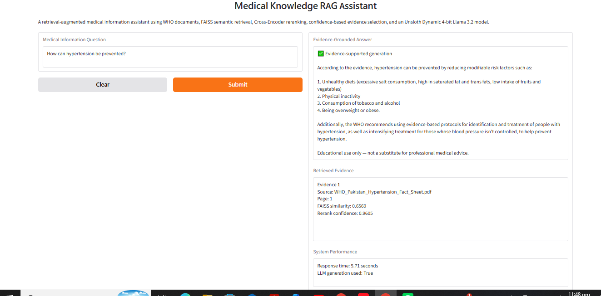
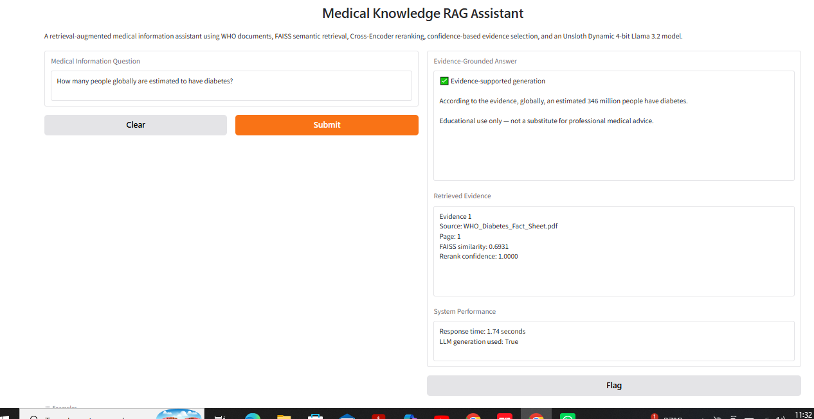
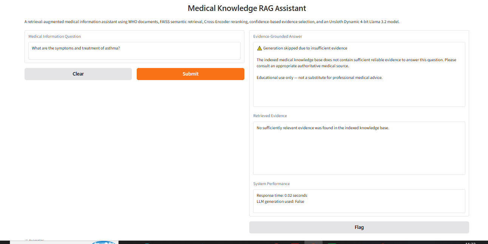

# 🩺 Medical Knowledge RAG Assistant with Unsloth Dynamic 4-bit Llama 3.2

An evidence-grounded medical Retrieval-Augmented Generation (RAG) system combining authoritative WHO documents, semantic retrieval, Cross-Encoder reranking, confidence-based evidence filtering, and memory-efficient LLM inference using Unsloth Dynamic 4-bit quantization.

> **Educational project only — not a substitute for professional medical advice, diagnosis, or treatment.**

---

## 🚀 Project Overview

Large Language Models can generate fluent responses even when the underlying information is unsupported. This project explores a safer approach to domain-specific medical question answering by combining retrieval with guarded generation.

The system first searches an indexed collection of World Health Organization (WHO) medical documents for relevant evidence. Retrieved passages are filtered and reranked before being supplied to a quantized Llama 3.2 language model.

If the available evidence is insufficient, the system **does not invoke the LLM to generate a medical answer**. Instead, it returns a controlled insufficient-evidence response.

The current prototype focuses primarily on:

- Hypertension
- Diabetes

---

## 🎯 Project Objectives

The project was designed to:

- build a complete Retrieval-Augmented Generation pipeline;
- use authoritative domain-specific medical documents;
- reduce unsupported LLM responses through evidence grounding;
- improve retrieval quality using Cross-Encoder reranking;
- identify unsupported questions before generation;
- run a capable language model efficiently on limited GPU hardware;
- provide transparent source and page information;
- evaluate retrieval and refusal behavior systematically;
- provide an interactive user-facing demonstration.

---

## 🧠 System Architecture

```text
User Question
      ↓
Sentence Transformer Embedding
      ↓
FAISS Semantic Retrieval
      ↓
Similarity Filtering
      ↓
Cross-Encoder Reranking
      ↓
Confidence-Based Evidence Selection
      ↓
Is sufficient evidence available?
      ↓
 ┌───────────────┬────────────────────┐
 │ Yes           │ No                 │
 ↓               ↓
Dynamic 4-bit    Controlled Refusal
Llama 3.2
      ↓
Evidence-Grounded Answer
      ↓
Source + Page + Retrieval Metrics
```

---

## 🔍 Key Features

### Retrieval-Augmented Generation

Medical documents are divided into overlapping chunks, embedded using a Sentence Transformer, and indexed using FAISS for semantic retrieval.

### Cross-Encoder Reranking

Initial FAISS candidates are reranked using a Cross-Encoder model so that the passages most directly related to the user's question receive higher priority.

### Confidence-Based Evidence Filtering

Low-confidence passages are removed before generation. This prevents loosely related retrieved text from automatically reaching the language model.

### Guarded Generation

If no sufficiently relevant evidence remains after retrieval and reranking, the system skips LLM generation and returns a controlled insufficient-evidence response.

### Source Transparency

Generated responses are accompanied by:

- source document;
- page number;
- FAISS similarity score;
- reranking confidence;
- response time;
- LLM generation status.

### Memory-Efficient LLM Inference

The generation model uses:

**Llama 3.2 3B Instruct with Unsloth Dynamic 4-bit quantization**

During the experiment, approximately **2.24 GB of GPU memory was allocated after model loading** on an NVIDIA Tesla T4.

### Interactive Demo

A Gradio interface allows users to enter medical-information questions and inspect:

- evidence-grounded responses;
- retrieved evidence;
- retrieval confidence;
- source information;
- generation status;
- response time.

---

## 🛠️ Technology Stack

| Component | Technology |
|---|---|
| Language Model | Llama 3.2 3B Instruct |
| Quantization | Unsloth Dynamic 4-bit |
| Embeddings | Sentence Transformers |
| Embedding Model | all-MiniLM-L6-v2 |
| Vector Search | FAISS |
| Reranking | Cross-Encoder MS MARCO MiniLM |
| Document Processing | PyPDF |
| Interface | Gradio |
| Framework | PyTorch / Transformers |
| Environment | Google Colab |
| GPU | NVIDIA Tesla T4 |
| Knowledge Sources | World Health Organization documents |

---

## 📚 Knowledge Base

The prototype currently indexes authoritative WHO documents covering:

- hypertension;
- diabetes.

Documents are processed page by page so that source and page metadata remain attached to each retrieval chunk.

The current knowledge base is intentionally limited. Questions about unrelated medical topics should therefore trigger the system's evidence-sufficiency protection rather than receive unsupported answers.

---

## 📊 Evaluation

The final system was evaluated using a designed set of **10 questions** containing:

- supported hypertension questions;
- supported diabetes questions;
- unsupported medical questions.

### Evaluation Results

| Evaluation Metric | Result |
|---|---:|
| Total evaluation questions | 10 |
| Source-routing accuracy | 100% |
| Generation/refusal behavior accuracy | 100% |
| Supported-query generation rate | 100% |
| Unsupported-query refusal accuracy | 100% |
| Average response time | 4.82 seconds |

> These results describe performance only on the designed 10-question evaluation set. They should **not** be interpreted as general medical or clinical accuracy.

---

## 🖥️ Demo Results

### Supported Query — Hypertension

The system retrieves relevant WHO hypertension evidence and generates an evidence-grounded response.



---

### Supported Query — Diabetes

The system correctly routes a diabetes-related question to the WHO diabetes document and generates a grounded response.



---

### Unsupported Query — Asthma

Asthma information is not contained in the current indexed knowledge base.

Instead of allowing the language model to guess, the system detects insufficient evidence and skips generation.



---

## 🧪 Example Behavior

### Supported Question

**Question:**

`How can hypertension be prevented?`

The system:

1. retrieves WHO hypertension passages;
2. removes weak semantic matches;
3. reranks the remaining evidence;
4. selects the strongest evidence;
5. sends only supported context to the Dynamic 4-bit LLM;
6. generates an evidence-grounded response.

### Unsupported Question

**Question:**

`What are the symptoms and treatment of asthma?`

Because the current indexed knowledge base does not contain sufficiently relevant asthma evidence:

`LLM generation used: False`

The system returns a controlled insufficient-evidence response instead of producing an unsupported medical answer.

---

## 📂 Repository Structure

```text
medical-rag-unsloth-dynamic4bit/
│
├── Medical_RAG_Unsloth_Dynamic4bit_Month2_Task3.ipynb
├── README.md
│
└── assets/
    ├── demo_hypertension_supported.png
    ├── demo_diabetes_supported.png
    └── demo_asthma_refusal.png
```

---

## ▶️ Running the Project

The complete implementation is available in:

`Medical_RAG_Unsloth_Dynamic4bit_Month2_Task3.ipynb`

### Recommended Environment

- Google Colab
- NVIDIA T4 GPU or equivalent
- Python 3

The notebook covers the complete workflow:

1. environment and GPU setup;
2. Unsloth Dynamic 4-bit model loading;
3. GPU memory measurement;
4. WHO document acquisition;
5. PDF text extraction;
6. text chunking;
7. embedding generation;
8. FAISS indexing;
9. semantic retrieval;
10. retrieval-confidence filtering;
11. Cross-Encoder reranking;
12. dynamic evidence selection;
13. guarded RAG generation;
14. evaluation;
15. interactive Gradio demo.

---

## ⚠️ Limitations

This project is a prototype and has several important limitations:

- the indexed medical knowledge base is small;
- only a limited number of medical topics are currently covered;
- retrieval thresholds were selected empirically for the current document collection;
- the evaluation set contains only 10 designed questions;
- the application has not undergone clinical validation;
- retrieval quality may change when additional documents are introduced;
- the system should not be used for diagnosis, treatment decisions, or emergency medical guidance.

---

## 🛡️ Safety Design

A key goal of this project is to reduce unsupported generation.

The final system therefore uses:

1. semantic similarity filtering;
2. Cross-Encoder reranking;
3. confidence-based evidence selection;
4. generation refusal when evidence is insufficient;
5. explicit source and page tracking;
6. a medical-use disclaimer.

This architecture does not eliminate hallucination risk, but it adds explicit safeguards before the LLM is allowed to generate a response.

---

## 🔮 Future Improvements

Future development could include:

- expanding the knowledge base with additional authoritative medical documents;
- hybrid semantic and keyword retrieval;
- larger and more diverse evaluation sets;
- automated retrieval-quality benchmarking;
- direct links to original source documents;
- persistent web deployment;
- conversational memory with evidence grounding;
- improved document chunking strategies;
- retrieval-threshold calibration;
- hallucination and factuality evaluation;
- automated citation generation.

---

## 💡 What I Learned

This project provided practical experience with:

- Retrieval-Augmented Generation;
- vector embeddings;
- semantic search;
- FAISS indexing;
- document chunking;
- metadata-aware retrieval;
- Cross-Encoder reranking;
- confidence-based retrieval filtering;
- guarded LLM generation;
- Dynamic 4-bit quantization;
- GPU memory management;
- RAG evaluation;
- safety-oriented AI design;
- Gradio application development.

---

## 👩‍💻 Author

**Kaunain Gul Khalid**

BS Artificial Intelligence  
University of Malakand

Developed as part of a Generative AI internship project and extended into a portfolio-focused implementation of guarded, evidence-grounded Retrieval-Augmented Generation.
